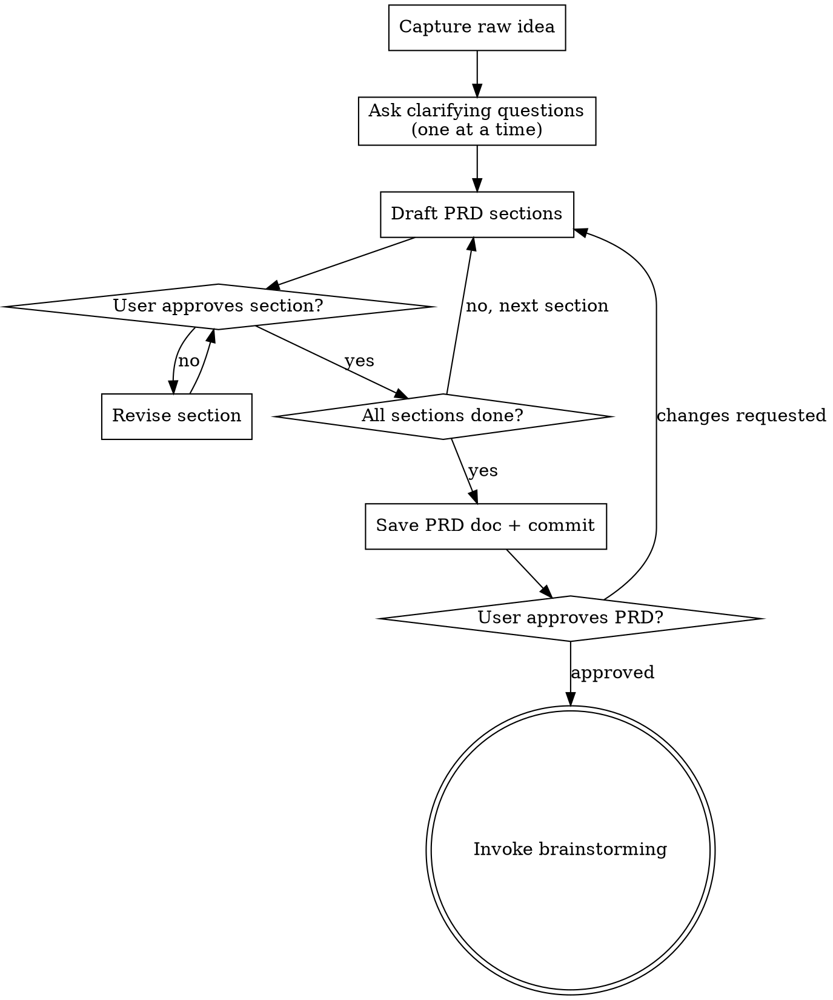

# Product Requirements Document (PRD)

## Overview

Turn a vague feature idea into a crisp PRD: problem statement, user personas, success criteria, out-of-scope, and concrete acceptance criteria. The output is a saved PRD doc that gates entry into design (brainstorming) and implementation.

**Announce at start:** "I'm using the prd skill to create a Product Requirements Document."

<HARD-GATE>
Do NOT enter brainstorming, write specs, write plans, or touch code until the PRD is written, reviewed, and the user approves it.
</HARD-GATE>

## Checklist

Complete in order:

1. **Capture the raw idea** — one sentence summary of what the user wants
2. **Ask clarifying questions** — one at a time, covering the five PRD sections below
3. **Draft the PRD** — present each section, get approval before moving to the next
4. **Save the PRD** — write to `docs/prd/YYYY-MM-DD-<feature-slug>.md` and commit
5. **User review gate** — ask user to approve before proceeding
6. **Transition** — invoke `superpowers:brainstorming` to design the solution

## Process Flow



## The Five PRD Sections

Work through these sequentially. Each section is presented and approved before the next.

### 1. Problem Statement
- What problem does this solve? Who experiences it?
- What does the world look like today (without the solution)?
- Why does this matter now?
- Keep to 2-4 sentences — ruthlessly cut scope-creep framing.

### 2. User Personas
- Who are the primary users? (role, context, technical level)
- What is their current workaround?
- Secondary users or stakeholders?
- One persona is fine if there's truly only one.

### 3. Goals & Success Criteria
- What does success look like in concrete, measurable terms?
- What are the top 2-3 things that MUST be true for this to ship?
- Prefer quantifiable metrics (latency, error rate, task completion time).

### 4. Non-Goals (Out of Scope)
- What are we explicitly NOT building?
- What could be confused as in-scope but isn't?
- Future phases go here, not in section 3.

### 5. Acceptance Criteria
- Concrete, testable conditions (Given / When / Then format preferred).
- Each criterion must be binary: pass or fail, no interpretation.
- Minimum 3 criteria; max ~10 (if more needed, scope is too large).

**Example format:**
```
- [ ] Given a logged-in user, when they submit the form with valid data, then the record is saved and a success toast appears within 500ms.
- [ ] Given an unauthenticated user, when they access the page, then they are redirected to /login.
- [ ] Given an invalid email, when the form is submitted, then an inline error appears and no network request is made.
```

## Clarifying Questions Bank

Use these to fill gaps before drafting. One at a time:

- "Who is the primary user — internal team, end customer, or both?"
- "What's the pain today? Walk me through the current workflow."
- "What would make this a success 3 months after launch?"
- "What are we definitely NOT building in this version?"
- "Do you have a timeline or deadline driving this?"
- "Are there dependencies — other teams, services, or features that must land first?"
- "Any known constraints — performance, compliance, backward compatibility?"

## PRD Document Template

```markdown
# PRD: [Feature Name]

**Date:** YYYY-MM-DD
**Status:** Draft | Approved
**Author:** [name]

---

## Problem Statement

[2-4 sentences]

## User Personas

**Primary:** [Role] — [context, workaround]
**Secondary (if any):** [Role] — [context]

## Goals & Success Criteria

- [Measurable goal 1]
- [Measurable goal 2]
- [Measurable goal 3]

## Non-Goals

- [Explicitly out of scope 1]
- [Explicitly out of scope 2]

## Acceptance Criteria

- [ ] Given ... when ... then ...
- [ ] Given ... when ... then ...
- [ ] Given ... when ... then ...

## Open Questions

- [Unresolved question 1]
- [Unresolved question 2]
```

## Saving & Transitioning

**Save location:** `docs/prd/YYYY-MM-DD-<feature-slug>.md`
- User preferences override this default.

**After saving, ask:**
> "PRD saved to `<path>`. Please review it — let me know if anything needs adjusting before we move into design."

**After user approves:**
- Invoke `superpowers:brainstorming` to design the solution.
- Pass the PRD path as context when brainstorming begins.
- Do NOT jump to `writing-plans` or code — brainstorming comes next.

## Key Principles

- **One question at a time** — never overwhelm with a list of questions upfront.
- **YAGNI on scope** — push future ideas to Non-Goals, not Goals.
- **Acceptance criteria are binary** — if you can't write a test for it, rewrite the criterion.
- **Short PRDs ship** — target 1-2 pages. If it's longer, the scope is too big.
- **No solutions in the PRD** — describe the problem and success state, not the implementation.
